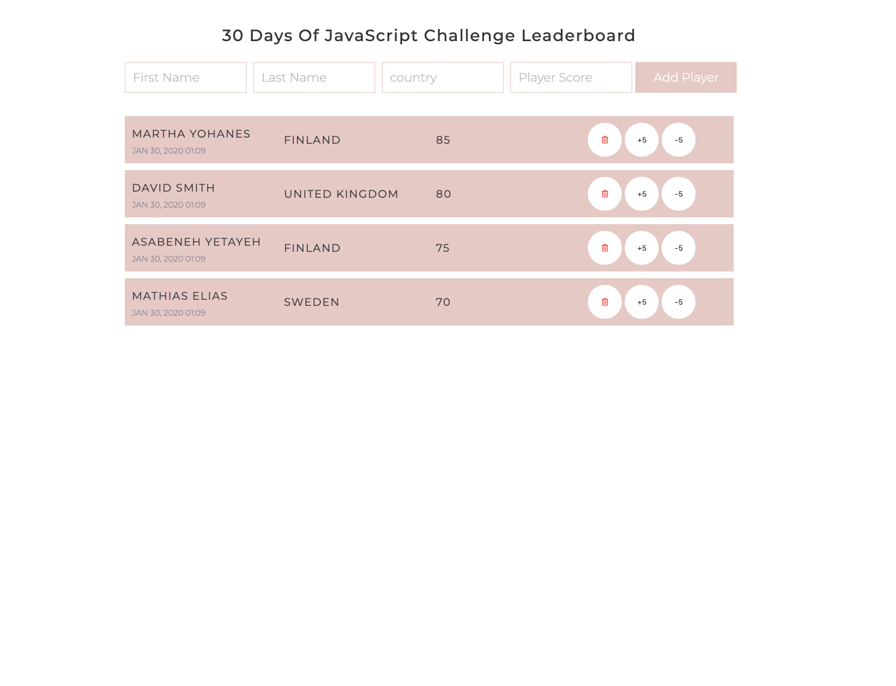

  <h1> Day 28: Mini Project Leaderboard.</h1>
  
  

## Level : 1

1. Create the following using HTML, CSS, and JavaScript

    

🎉 ✅Completed 🎉

[<< Day 27](/Day27/Day27.md) | [Day 29 >>](/Day29/Day29.md)
