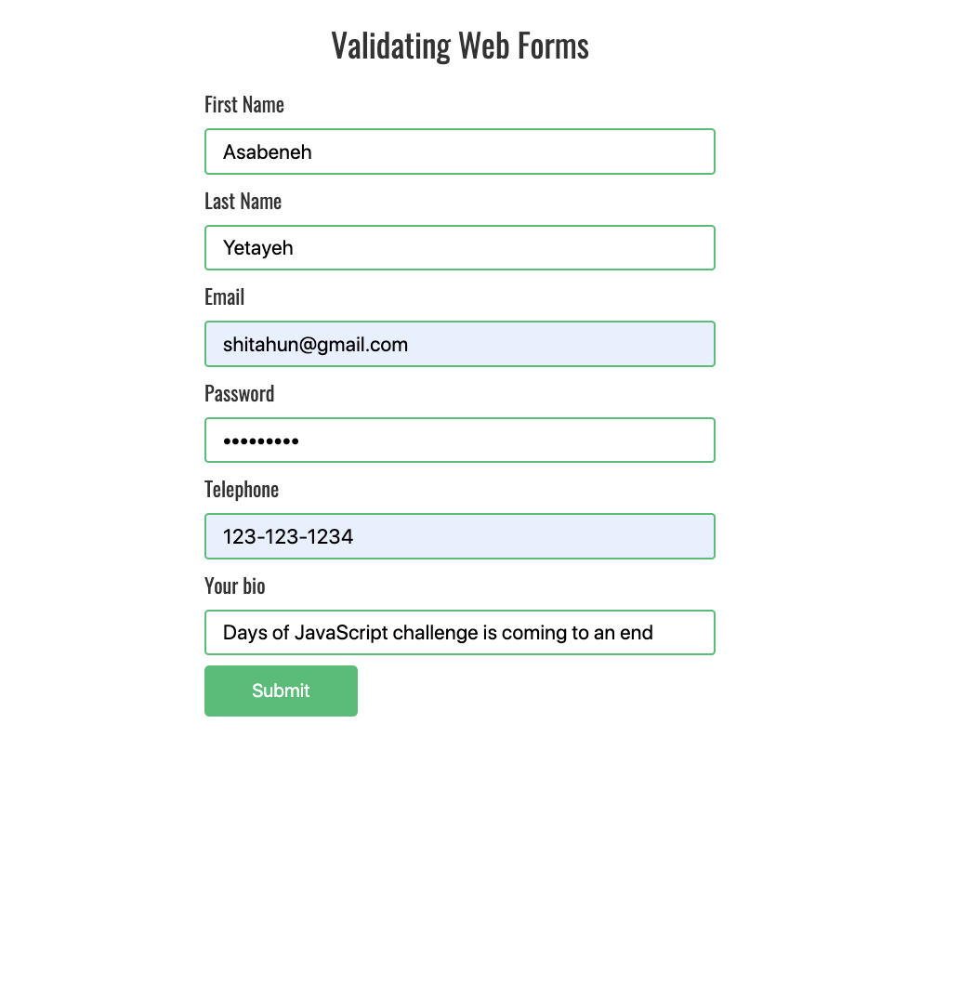

  <h1> Day 30: Mini Final Projects.</h1>
  
  

## Level : 1

1. Create the following animation using (HTML, CSS, JS)

    

2. Validate the following form using regex.

   

   

🎉 ✅Completed 🎉

[<< Day 29](/Day29/index.md)
